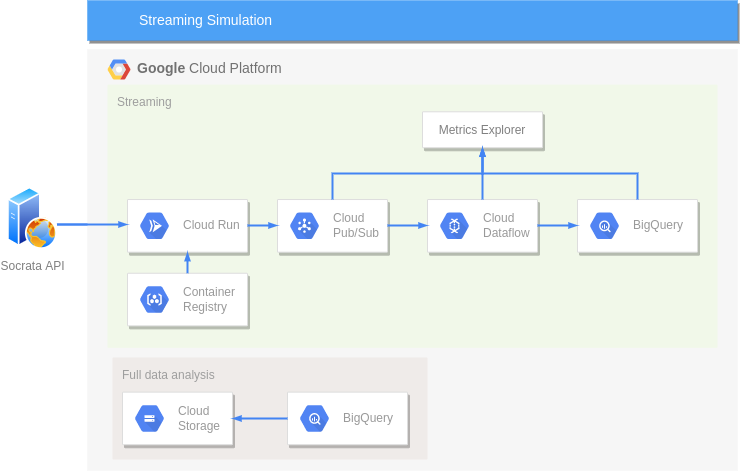
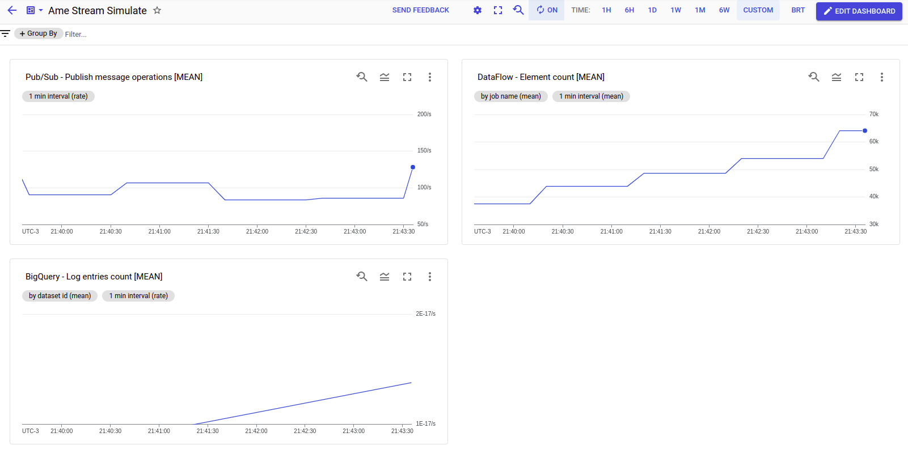
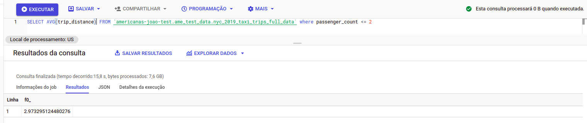
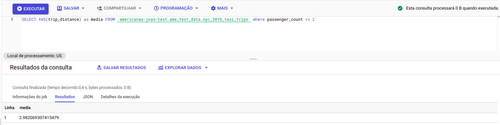
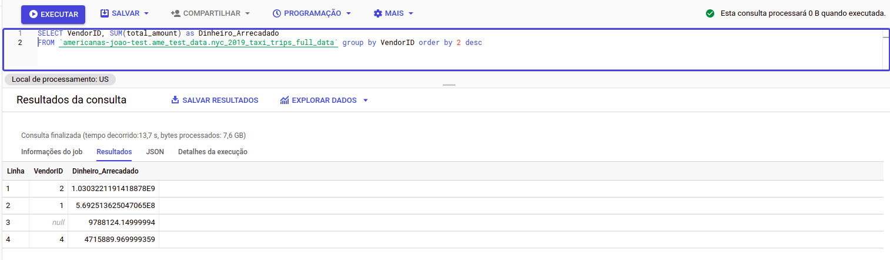
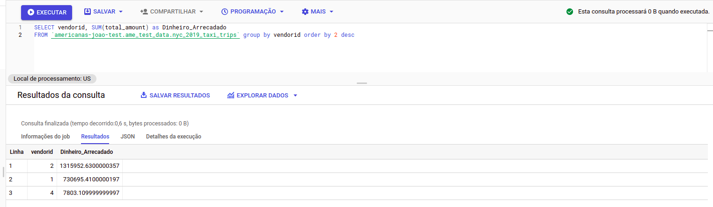
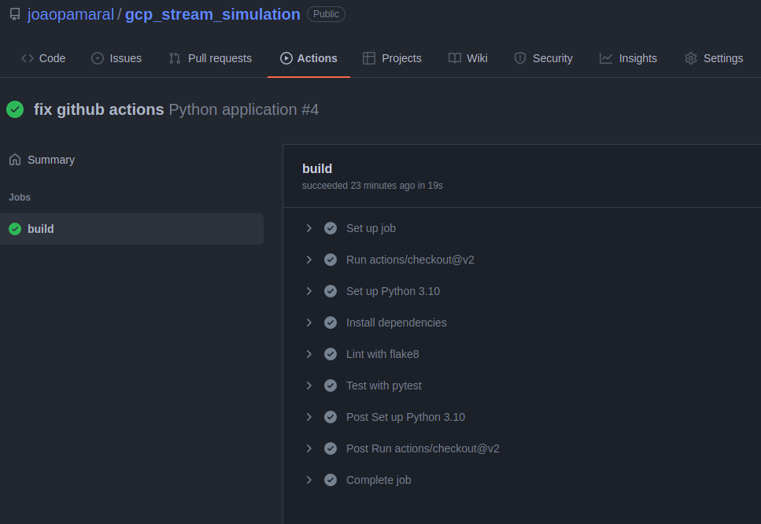

# Projeto de Simulador de Streaming rodando na Google Cloud Plataform

Esse projeto teve o objetivo de construir um simulator de streaming rodand na GCP e utilizando os dados da base de viagens de táxi de New York de 2019.

## Pré-requisitos

- Possuir uma conta na [GCP](https://cloud.google.com/)
- Instalar o [terraform](https://www.terraform.io/)
  - Executar o comando `terraform init` dentro da pasta terraform
- Instalar o [GNU make](https://www.gnu.org/software/make/) (opcional)
- Instalar o python >= 3.7
  - Instalar os pacotes de produção e desenvolvimento
    - `pip install -r requirements.txt`
    - `pip install -r requirements-dev.txt`
- Instalar o [gcloud cli](https://cloud.google.com/sdk/docs/install)
  - Após a instalação iniciar o cli `gcloud init` e configurar o acesso ao projeto

## Arquitetura



A arquitetura desenvolvida para esse projeto foi visando utilizar todo simulador e processamento streaming em cloud.

### Ingestão dos dados

A ingestão dos dados é feitor por um simulador que foi desenvolvido em python e faz as requisições dos dados por meio de uma [API](https://dev.socrata.com/foundry/data.cityofnewyork.us/2upf-qytp). Toda a definição de quantos dados serão obtidos, qual o intervalo de requisição e por quanto os dados serão coletados foi todo parametrizado na aplicação. 

Após obter os dados, eles são enviados para o Cloud PubSub por meio da api do google cloud.

```
usage: stream_simulate.py [-h] [-d DOMAIN] [-ds DATASET_ID] [-l LIMIT] [-t TIMEOUT] [-rt REQUEST_TIME]

Stream Simulate - simulate streaming behaviour for Socrata Open Data API

optional arguments:
  -h, --help            show this help message and exit
  -d DOMAIN, --domain DOMAIN
                        Data domain
  -ds DATASET_ID, --dataset_id DATASET_ID
                        Dataset identifier
  -l LIMIT, --limit LIMIT
                        Number of rows returned in each interaction (default 10000)
  -t TIMEOUT, --timeout TIMEOUT
                        Timeout in seconds to stop the simulator (default inf)
  -rt REQUEST_TIME, --request_time REQUEST_TIME
                        Time in seconds between each request (default 1 sec)
```

Essa aplicação foi containerizada e sua imagem foi armazenada no Cloud Registry e utilizada pelo Cloud Run para manter a sua execução em cloud.

Uma outra opção seria utilizar o Cloud Functions e agendar as requisições por meio do do Cloud Scheduler ou até mesmo utilizar um Apache Airflow (Cloud Composer) para orquestrar as chamas a function.

### Processamento Streaming

As mensagens que chegam ao tópico do PubSub são automaticamnte processadas pelo Cloud Dataflow que obtém cada entrada e envia para o BigQuery.

### Data Warehouse

Os dados são armazenados no BigQuery que permite realizar as análises necessários em um tempo de processamento reduzido.

Uma boa prática é utilizar o particionamento dos dados de entrada, uma opção bastante utilizada é particionar os dados por dia para que a análise realizada em certos dias utilizem apenas esses dados gerando um custo menor e uma performance melhor.

## Construindo a arquitetura na GCP

Todo os serviços da cloud, configurações e integrações utilizadas nesse projeto foram desenvidos utilizando o terraform (IaC - Infrastructure as Code), sendo que nenhuma ação manual na cloud é necessária para subir o ambiente do simulador e processamento dos dados em streaming.

Antes de executar o comando para subir a infra, é necessário primeiramente criar o projeto na GCP e definir nas variáveis definidas no arquivo terraform:

```terraform
variable "ame_project" {default = "MY_PROJECT"}
variable "region" {default = "us-central1"}
variable "zone" {default = "us-central1-c"}
```

Após a definição das variáveis, verifique as alterações que serão realizadas no seu projeto:

```shell
terraform plan
```

Tudo certo, você está pronto para construir a infra na cloud:

```shell
terraform apply
```

Não esqueça de após realizar todos os testes remover a infra da cloud (caso contrário, você será cobrado pelos tempo/processamento dos serviços utilizados):

```shell
terraform destroy
```

## Métricas

Para visualizar as métricas e analisar o funcionamento dos serviços (assim como o fluxo dos dados), foi construído um dashboard no metrics explorer que mostra os dados entrando no PubSub, sendo processados pelo DataFlow e sendo inseridos no BigQuery.



Dessa forma é possível visualizar rapidamente (e criar alertas automáticos) caso ocorra algum pico de demanda ou até mesmo a falta de dados.

## Análise dos dados

Para analisar os dados, foi utilizado a interface de consulta do BigQuery. Além disso, foi utilizado uma arquitetura paralela com todos os dados inseridos para a realização das consultas (além da demonstração da mesma análise na arquitetura streaming)

- Qual a distância média percorrida por viagens com no máximo 2 passageiros:

Para responder essa pergunta foi utilizada a sequinte query:

```sql
SELECT AVG(trip_distance) as media 
FROM `americanas-joao-test.ame_test_data.nyc_2019_taxi_trips` 
WHERE passager_count <= 2
```

Todos os dados:


Streaming:


- Quais os 3 maiores vendors em quantidade total de dinheiro arrecadado:

Para responder essa pergunta foi utilizada a sequinte query:

```sql
SELECT vendorid, SUM(total_amount) as Dinheiro_Arrecadado 
FROM `americanas-joao-test.ame_test_data.nyc_2019_taxi_trips` 
GROUP BY vendorid
ORDER BY 2 desc
```

Todos os dados:


Streaming:


## Qualidade de Dados

Uma opção para realizar uma análise da qualidade dos dados, é verificar durante a etapa de processamento (DataFlow) e analisar os campos que estão sendo ingeridos (valores nulos, outliers, dado mal formatado, etc). Dessa forma, é possível gerar métricas em tempo real e evitar de ingerir dado de má qualidade.

Uma outra opção é realizar análises periódicas dos dados no Data Warehouse (BigQuery), gerando um relatório diario/semanal/mensal verificando a qualidade dos dados por meio de queries pre definidas. Nesse caso essa verificação/relatório poderia ser orquestrado por meio de uma ferramenta como o Apache Airflow.

## Ambiente de Testes

Nesse projeto não foi desenvolvido um ambiente local para testes, mas um exemplo seria a utilização de um docker compose que subisse um ambiente com um kafka, apache beam e um banco de dados (nosql ou sql) já integrados.

Esse ambiente poderia auxiliar na criação e testes de scripts do apache beam (para executar no data flow). Com isso seria possível definir um pre-processamento dos dados mais completos e até mesmo auxiliar na medição da qualidade dos dados de entrada.

Para esse projeto foi utilizado o template já disponibilizado pela GCP [PubSub_to_BigQuery](https://cloud.google.com/dataflow/docs/guides/templates/provided-streaming)

## CI/CD

Nesse projeto foi definido um teste simples, para verificar o esquema de entrada e testar o simulador.

O teste pode ser chamado localmente por meio do comando `make test_simulator`.

Foi configurado um github actions para que o teste seja executado a cada commit (arquivo `.github/workflows/python-app.yml`).



Para esse projeto, não foi definido um deployment automatico (pois o simulador é apenas para teste), mas se esse projeto fosse uma solução real, poderia ser definido no github actions o build e deploy da imagem no qual o container do simulador roda diretamente para cloud (forçando o container a atualizar a ultima versão). 

Para tal, seria necessário configurar a autenticação de acesso ao projeto no github actions e utilizaro o comando `make build_submit_cloud_image`
